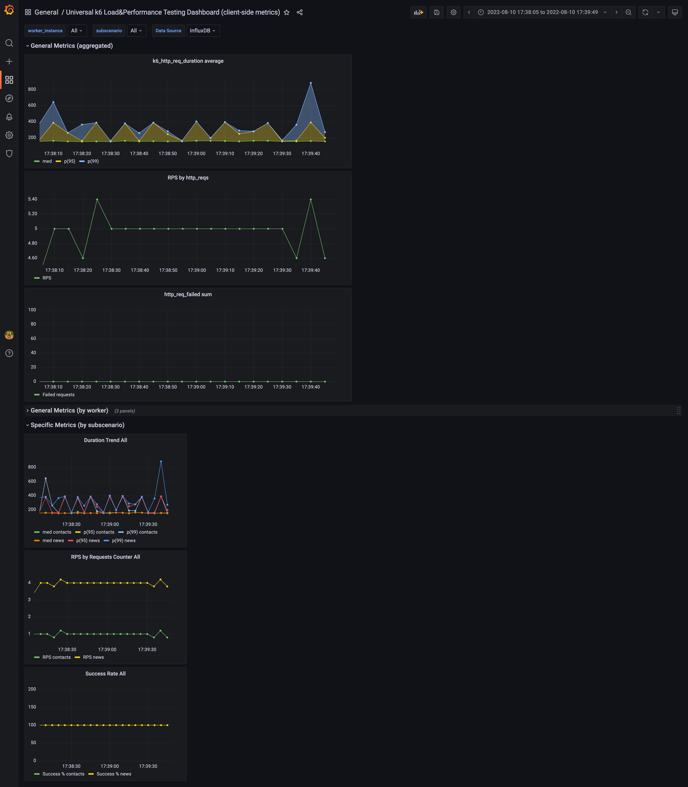

# Prerequisites

1. Docker
2. Docker Compose
3. k6

# Setup

```
$ docker-compose up -d
```

# Usage

Replace `PATH_TO_K6_SCENARIO` with path to your scenario and run:

```
$ k6 run --out influxdb=http://localhost:8086/k6 PATH_TO_K6_SCENARIO
```

Then open http://localhost:3000 and explore k6 standard and your scenario custom metrics.

How dashboard could look like for scenario with 1 worker and 2 subscenarios:



# Note

Tested on GNU/Linux (Ubuntu 22.04) and on macOS Monterey (v12.2.1) only, but should be cross-platform solution. The
only platform-specific thing is `extra_hosts` in `docker-compose.yaml` for Docker on GNU/Linux.
